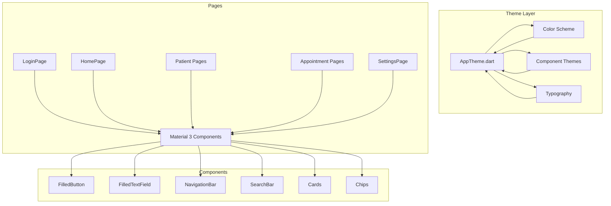

# Material Design 3 UI Modernization Plan
## Dental Clinic Patient Management System

### Executive Summary
This plan outlines comprehensive UI/UX improvements to transform the existing Flutter dental clinic application into a modern, polished interface following Google's Material Design 3 (Material You) principles. The application already has `useMaterial3: true` enabled, but will be enhanced with proper M3 color schemes, component styling, typography, and interaction patterns.

---

## Current State Analysis

### Strengths
- Material 3 already enabled in ThemeData
- Light/Dark theme support implemented
- Google Fonts (Roboto) integrated
- Clean codebase structure with BLoC pattern

### Areas for Improvement
1. **Color System**: Not using M3 color roles (primaryContainer, secondaryContainer, surfaceTint)
2. **Components**: Using legacy components instead of M3 variants
3. **Typography**: Not fully utilizing M3 type scale
4. **Navigation**: Using deprecated BottomNavigationBar instead of NavigationBar
5. **Forms**: Not using FilledTextField and modern form styling
6. **Cards**: Lacking M3 elevation and tonal surfaces

---

## Proposed Material Design 3 Enhancements

### 1. Color Scheme Upgrade
**Goal**: Create a cohesive dental/medical color palette with proper M3 color roles

#### Light Theme Colors
| Role | Color | Usage |
|------|-------|-------|
| Primary | Teal (#008080) | Main actions, FAB, active states |
| On Primary | White | Text on primary |
| Primary Container | Light Teal (#B2DFDB) | Selected items, chips |
| On Primary Container | Dark Teal | Text on container |
| Secondary | Blue Grey (#607D8B) | Secondary actions |
| Secondary Container | Light Blue Grey (#CFD8DC) | Secondary surfaces |
| Tertiary | Amber (#FFC107) | Accents, warnings |
| Surface | White (#FFFFFF) | Card backgrounds |
| Surface Variant | Light Grey (#F5F5F5) | Alternate surfaces |
| Error | Red (#F44336) | Error states |

#### Dark Theme Colors
| Role | Color | Usage |
|------|-------|-------|
| Primary | Light Teal (#4DB6AC) | Main actions |
| On Primary | Dark Teal | Text on primary |
| Primary Container | Dark Teal (#00695C) | Selected items |
| On Primary Container | Light Teal | Text on container |
| Secondary | Light Blue Grey (#90A4AE) | Secondary actions |
| Surface | Dark Grey (#1E1E1E) | Card backgrounds |
| Surface Variant | Medium Grey (#2D2D2D) | Alternate surfaces |

---

### 2. Component Theme Upgrades

#### Buttons
| Current | Material 3 Equivalent |
|---------|----------------------|
| ElevatedButton | FilledButton (primary actions) |
| ElevatedButton (secondary) | TonalButton |
| OutlinedButton | OutlinedButton (keep) |
| TextButton | TextButton (keep) |

#### Input Fields
- Replace standard TextField with FilledTextField
- Add proper error states with M3 styling
- Use outlined variant for optional fields

#### Cards
- Apply surfaceTint for elevation indication
- Use tonal elevation for depth
- Implement rounded corners (16dp radius)

#### Navigation
- Replace BottomNavigationBar with NavigationBar
- Use proper M3 indicator style
- Add labels support

---

### 3. Page-by-Page Modernization Plan

#### LoginPage
```
Current Issues:
- Basic centered form layout
- Standard ElevatedButton
- Simple icon display

Improvements:
- Add decorative background with gradient
- Use FilledButton for primary action
- Add loading state with M3 CircularProgressIndicator
- Improve form field styling with FilledTextField
- Add subtle animation on load
```

#### SplashPage
```
Current Issues:
- Plain background color
- Basic centered layout

Improvements:
- Add animated logo transition
- Use M3 Surface with tonal elevation
- Add subtle gradient background
- Use M3 loading indicator
```

#### HomePage
```
Current Issues:
- Basic action buttons as cards
- Simple stat cards
- Standard ListView for patients

Improvements:
- Use FilledCard for action buttons
- Implement modern Dashboard layout with GridView
- Add Chip components for quick filters
- Use modern ListTile with leading images
- Add NavigationBar for main navigation
- Implement Hero animations for transitions
```

#### PatientListPage
```
Current Issues:
- Standard TextField for search
- Basic Card layout for list items
- Standard FloatingActionButton

Improvements:
- Use SearchBar (M3 component)
- Implement modern patient cards with proper elevation
- Use FilledTonalButton for FAB
- Add pull-to-refresh functionality
- Improve empty state display
```

#### PatientRegisterPage
```
Current Issues:
- Basic form layout with standard TextFields
- Simple dropdown styling

Improvements:
- Use FilledTextField for all inputs
- Add proper section dividers
- Use modern date picker
- Implement validation feedback with M3 styling
- Add progress indicator for multi-step forms
```

#### AppointmentListPage
```
Current Issues:
- Basic horizontal date selector
- Standard list items
- Simple chip styling

Improvements:
- Use CalendarDatePicker for date selection
- Implement modern FilterChip for status
- Add modern card styling for appointments
- Use SegmentedButton for date range
- Improve timeline view
```

#### SettingsPage
```
Current Issues:
- Basic ListTile styling
- Standard SwitchListTile
- Simple section headers

Improvements:
- Use ListTile with M3 styling
- Implement proper Switch with M3 appearance
- Add modern section headers
- Improve logout dialog styling
- Add avatar with M3 styling
```

#### ScanPage
```
Current Issues:
- Basic TabBar styling
- Simple button styling

Improvements:
- Use TabBar with M3 indicator
- Implement modern camera placeholder
- Use FilledTonalButton for actions
- Add proper empty state
```

---

### 4. Implementation Architecture



---

### 5. Implementation Priority

| Priority | Task | Estimated Impact |
|----------|------|------------------|
| P0 | Theme Colors & Base Components | High |
| P0 | Navigation (NavigationBar) | High |
| P1 | Login & Splash Pages | Medium |
| P1 | Home Dashboard | High |
| P2 | Patient Management Pages | Medium |
| P2 | Appointment Pages | Medium |
| P2 | Settings Page | Low |
| P3 | Scan Page | Low |

---

### 6. Key Material Design 3 Principles Applied

1. **Color & Expression**: Using teal/blue-grey palette appropriate for medical/dental context
2. **Typography**: Using M3 type scale with proper font weights
3. **Elevation**: Using tonal elevation with surface tints
4. **Components**: Using modern M3 component variants
5. **Motion**: Adding subtle animations for state changes
6. **Accessibility**: Ensuring proper contrast ratios and touch targets

---

### 7. Technical Requirements

- Flutter SDK: 3.x+
- Packages to add: None (using built-in Material 3)
- Google Fonts: Already integrated
- Breaking changes: None (M3 is backward compatible)

---

## Success Criteria

1. ✅ All pages follow Material Design 3 guidelines
2. ✅ Consistent color application across all screens
3. ✅ Modern component styling (buttons, inputs, cards)
4. ✅ Proper light/dark theme implementation
5. ✅ Smooth animations and transitions
6. ✅ Improved usability and visual hierarchy
