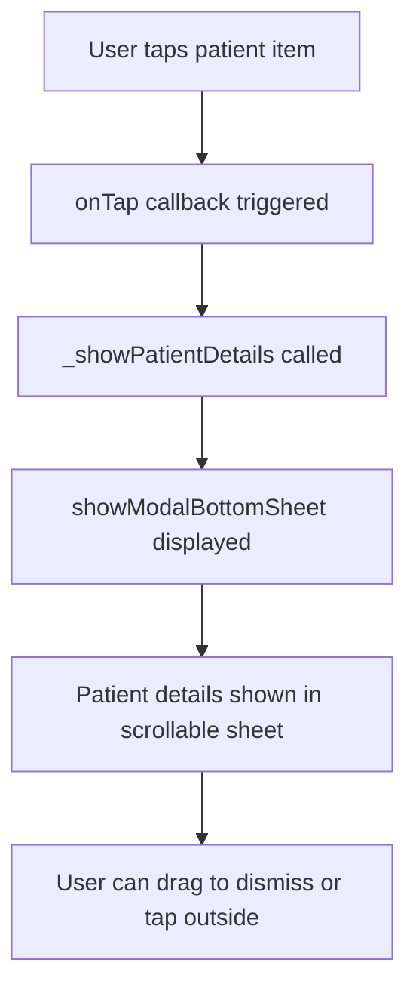

# Patient List Tap Functionality Implementation Plan

## Issue Summary
In [`patient_list_page.dart`](lib/presentation/pages/patient/patient_list_page.dart:187), the `onTap` callback for patient list items is empty:
```dart
onTap: () {},  // Line 187 - NO FUNCTIONALITY
```

This causes tapping on any patient in the list to do nothing.

## Solution
Implement a modal bottom sheet showing patient details when a patient is tapped, similar to how appointment details are displayed in [`appointment_list_page.dart`](lib/presentation/pages/appointment/appointment_list_page.dart:57).

---

## Implementation Steps

### Step 1: Add import for PatientModel
Ensure [`patient_list_page.dart`](lib/presentation/pages/patient/patient_list_page.dart:2) has the PatientModel import (already present).

### Step 2: Create `_showPatientDetails` method
Add a new private method `_showPatientDetails(BuildContext context, PatientModel patient)` to display a modal bottom sheet with patient information:

**Method Structure:**
- Use `showModalBottomSheet` with `isScrollControlled: true`
- Use `DraggableScrollableSheet` for scrollable content
- Display patient information in a similar style to [`_showAppointmentDetails`](lib/presentation/pages/appointment/appointment_list_page.dart:57)

**Patient Details to Display:**
| Field | Icon | Notes |
|-------|------|-------|
| Name | `Icons.person` | Primary info |
| Age / Gender | `Icons.cake` | Format: "Age • Gender" |
| Telephone | `Icons.phone` | |
| Address | `Icons.location_on` | |
| Email | `Icons.email` | If available |
| Occupation | `Icons.work` | If available |
| Status | `Icons.medical_information` | If available |
| Complaint | `Icons.description` | If available |
| Allergies | `Icons.warning_amber` | If available |
| Emergency Contact | `Icons.emergency` | Name + Phone |
| Last Visit | `Icons.calendar_today` | If available |
| Frequent Patient | `Icons.star` | Boolean indicator |

### Step 3: Update onTap callback
Replace the empty `onTap: () {}` at line 187 with:
```dart
onTap: () => _showPatientDetails(context, patient),
```

### Step 4: Add helper method for detail rows
Reuse or create a similar `_buildDetailRow` method (similar to [`appointment_list_page.dart:155`](lib/presentation/pages/appointment/appointment_list_page.dart:155)) to maintain consistency.

---

## Code Changes Summary

| File | Changes |
|------|---------|
| `lib/presentation/pages/patient/patient_list_page.dart` | Add `_showPatientDetails()` method, update `onTap` callback |

---

## Mermaid Flow Diagram



---

## Testing Checklist
- [ ] Tap on a patient shows modal bottom sheet
- [ ] All patient fields display correctly (or show placeholder if null)
- [ ] Modal is dismissible by dragging down or tapping outside
- [ ] Modal scrolls properly for patients with many fields
- [ ] UI matches app's Material Design 3 theme
