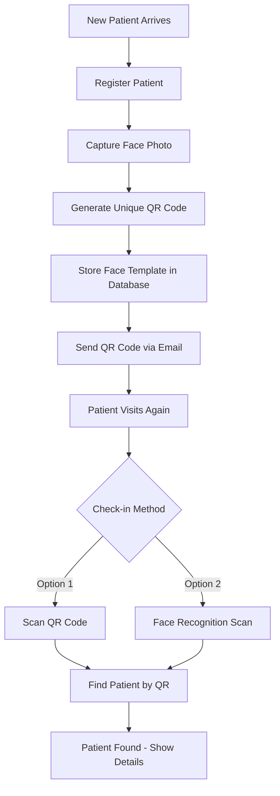

# QR Code and Face Recognition Flow Implementation Plan

## Recommended Workflow for Dental Clinic

Based on typical dental clinic workflows, here is the recommended approach:

### Flow Diagram



---

## When to Get QR Code and Face Scan?

### During Registration (Initial Visit)
- **QR Code Generation**: Generate immediately after patient is created
- **Face Capture**: Capture face during registration process
- This ensures the patient has their QR code ready for future visits

### During Check-in (Returning Visits)
- **QR Code Scan**: Patient can scan their QR code from email/printout
- **Face Recognition**: Patient can use face scan for quick identification (no need to remember QR code)

---

## QR Code Delivery: Email vs SMS

### Recommendation: EMAIL (Primary)

| Aspect | Email | SMS |
|--------|-------|-----|
| **Reliability** | High - patients check email regularly | Limited - SMS can be missed |
| **QR Code Size** | Can include high-res QR image | Limited character count |
| **Cost** | Lower (using existing email service) | Higher (SMS API costs) |
| **Print Option** | Easy to print from email | Harder to transfer to print |
| **Offline Access** | Can save email offline | Requires phone access |

**Implementation**: Use a backend service (like Supabase Edge Functions or a mail service) to send QR codes via email after patient registration.

---

## Face Recognition: How It Works

### Technical Approach

1. **Face Detection** (Already implemented with Google ML Kit)
   - Detects face bounding box
   - Identifies facial landmarks (eyes, nose, mouth, etc.)

2. **Face Template Creation** (Needs Implementation)
   - Extract face embeddings/descriptor from the detected face
   - This is a mathematical representation of the face (NOT the actual image)
   - Convert to a string that can be stored in the database

3. **Storage in Database**
   - Store the face template as a JSON string or base64 encoded string
   - Example: `[0.123, -0.456, 0.789, ...]` (128 floating point numbers)

4. **Face Matching** (For Future Scans)
   - Capture new face
   - Extract template
   - Compare with stored templates using cosine similarity or Euclidean distance

### Database Schema Addition

```prisma
model Patient {
  id            String   @id @default(uuid())
  qrCode        String   @unique
  faceTemplate  String?  // JSON string of face embeddings
  // ... existing fields
}
```

---

## Implementation Steps

### Phase 1: Backend Changes

1. **Database Migration**
   - Add `face_template` column to patients table
   - Add API endpoint for sending QR code email

2. **Email Service Integration**
   - Use Resend, SendGrid, or Supabase Edge Functions
   - Generate QR code image on-the-fly
   - Send email with QR code attachment

3. **Face Template Storage API**
   - Create endpoint to save/update face template
   - Create endpoint to retrieve face templates for matching

### Phase 2: Frontend Changes

1. **Patient Registration Page**
   - Add "Capture Face" button
   - Integrate camera for face capture
   - Extract face template using ML Kit
   - Send template to backend with registration

2. **After Registration**
   - Show success message with QR code
   - Option to send QR code via email
   - Option to display QR code for printing

3. **Scan Page Improvements**
   - Update face recognition to match against stored templates
   - Show patient details when match found
   - Handle no-match scenarios

4. **Patient Details Page**
   - Display patient's QR code
   - Option to re-send QR code via email
   - Option to re-capture face photo

---

## Technical Details

### Libraries Needed (Frontend)

| Package | Purpose |
|---------|---------|
| `google_mlkit_face_detection` | Face detection and template extraction |
| `qr_flutter` | QR code display in Flutter |
| `http` | API calls for email sending |

### Face Template Format

The face template from ML Kit is a `List<double>` (128 dimensions). Store as:
```json
{"embedding": [0.1, -0.2, 0.3, ...]} // 128 values
```

### Matching Algorithm

Use cosine similarity to compare face templates:
```
similarity = dot(A, B) / (||A|| * ||B||)
```
If similarity > 0.7 (threshold), consider it a match.

---

## Summary

| Feature | When | How |
|---------|------|-----|
| QR Code Generation | After registration | Auto-generated with patient ID |
| QR Code Delivery | After registration | Send via EMAIL |
| Face Capture | During registration | Camera capture with ML Kit |
| Face Storage | During registration | Store template in database |
| QR Scan | Check-in | Scan QR to find patient |
| Face Scan | Check-in | Match against stored templates |

This workflow provides multiple identification options for patients while maintaining a smooth registration and check-in process.
