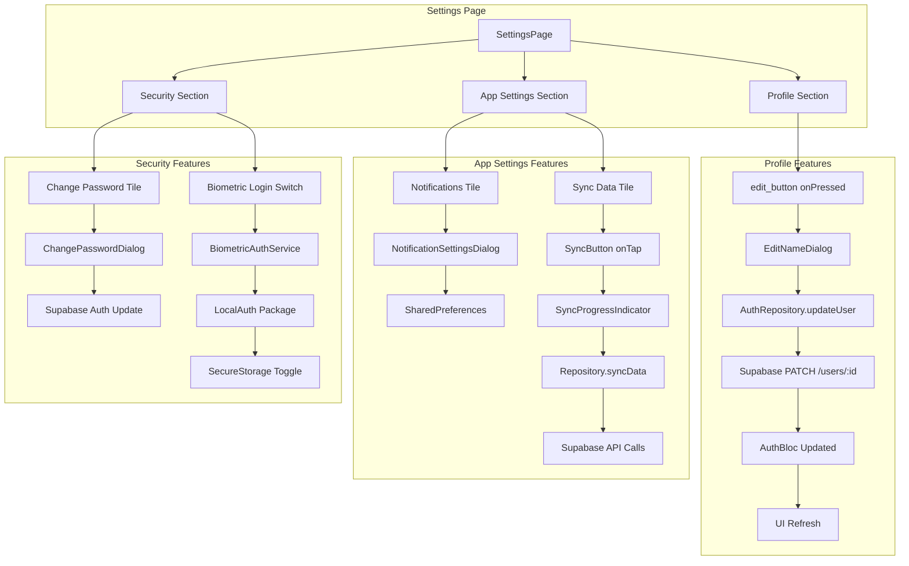

# Settings Page Enhancement - Technical Specification

## Overview

This document outlines the technical implementation plan for adding functional features to the Settings tab in the Dental Clinic Flutter application. The goal is to implement Edit Profile (Name), App Settings (Notifications, Sync Data), and Security (Change Password, Biometric Login) with real backend integration.

---

## Current State Analysis

### Existing Settings Page (`lib/presentation/pages/settings/settings_page.dart`)

The current Settings page has the following structure:
- **Profile Section**: Displays hardcoded "Dr. John Smith" with an edit button that has an empty `onPressed` callback (line 65)
- **App Settings Section**: Contains Dark Mode toggle (functional via ThemeBloc), Notifications tile, and Sync Data tile - both with empty `onTap` callbacks (lines 101, 111)
- **Security Section**: Contains Change Password tile and Biometric Login switch - all with empty callbacks (lines 124, 132)
- **About Section**: Static content
- **Logout**: Functional (uses AuthBloc)

### Backend Configuration

The app uses **Supabase** as backend with the following endpoints:
- **Base URL**: `https://vnodgfveyntfktrrlbat.supabase.co`
- **Users Table**: `$supabaseRest/v1/users`
- **Auth**: Supabase Auth for authentication

---

## Feature Requirements

### 1. Edit Profile - Change Name

**UI Changes Needed**:
- Implement edit button to show a dialog or navigate to edit profile screen
- Allow editing the user's display name
- Show save/cancel options

**Backend Integration**:
- Update user's name in the users table via Supabase REST API
- Endpoint: `PATCH /rest/v1/users/{user_id}`
- Update AuthBloc state to reflect the new name

**Data Flow**:
```
Edit Button → Dialog/Form → AuthRepository.updateUser() → Supabase API 
→ AuthBloc.updateUser() → Settings Page refresh
```

### 2. App Settings - Notifications

**UI Changes Needed**:
- Store notification preferences in local storage
- Create settings dialog for notification preferences
- Options: Enable/Disable, Sound, Vibration

**Implementation**:
- Use `shared_preferences` to store notification settings locally
- Settings structure:
```dart
class NotificationSettings {
  final bool enabled;
  final bool sound;
  final bool vibration;
}
```

### 3. App Settings - Sync Data

**UI Changes Needed**:
- Implement sync functionality
- Show sync progress/status indicator
- Handle sync errors gracefully

**Implementation**:
- Sync operations: Pull latest data from backend
- Use repository pattern for sync operations
- Show loading indicator during sync
- Display success/error snackbar after sync

### 4. Security - Change Password

**UI Changes Needed**:
- Create change password dialog/screen
- Fields: Current Password, New Password, Confirm Password
- Validate password strength
- Show password requirements

**Backend Integration**:
- Use Supabase Auth to update password
- Endpoint: Supabase Auth API - `/auth/v1/user`
- Require current password verification

### 5. Security - Biometric Login

**UI Changes Needed**:
- Implement biometric authentication toggle
- Use `local_auth` package for biometric authentication
- Store biometric preference in secure storage

**Implementation**:
- Add `local_auth` package dependency
- Enable/disable biometric login option
- Store preference in Flutter Secure Storage

---

## Architecture

### Mermaid Diagram: Feature Flow



---

## Implementation Steps

### Step 1: Update User Model with Update Method

**File**: `lib/data/models/user_model.dart`

Add method to create updated user instance:
```dart
UserModel copyWith({String? name}) {
  return UserModel(
    id: id,
    email: email,
    name: name ?? this.name,
    role: role,
    isActive: isActive,
    createdAt: createdAt,
    updatedAt: DateTime.now(),
  );
}
```

### Step 2: Extend AuthRepository

**File**: `lib/data/repositories/auth_repository.dart`

Add new methods:
```dart
/// Update user profile (name)
Future<AuthResult> updateUser({required String userId, String? name}) 

/// Change password
Future<AuthResult> changePassword({
  required String currentPassword,
  required String newPassword,
})

/// Get notification settings
Future<NotificationSettings> getNotificationSettings()

/// Save notification settings
Future<void> saveNotificationSettings(NotificationSettings settings)
```

### Step 3: Extend AuthBloc

**File**: `lib/presentation/blocs/auth/auth_bloc.dart`

Add events and states:
```dart
// Events
class UpdateUserProfile extends AuthEvent {
  final String name;
}
class ChangePassword extends AuthEvent {
  final String currentPassword;
  final String newPassword;
}

// States
class UserProfileUpdated extends AuthState {
  final UserModel user;
}
class PasswordChanged extends AuthState {}
class AuthSecurityError extends AuthState {
  final String message;
}
```

### Step 4: Create Settings BLoC (Optional - could use existing)

Consider creating a separate `SettingsBloc` for managing settings state:
- Notification settings
- Sync status
- Biometric preferences

### Step 5: Update Settings Page

**File**: `lib/presentation/pages/settings/settings_page.dart`

Implement UI changes:
1. **Edit Profile Dialog**: TextField with current name, Save/Cancel buttons
2. **Notifications Settings Dialog**: Checkboxes for enabled, sound, vibration
3. **Sync Data**: Show CircularProgressIndicator during sync, handle results
4. **Change Password Dialog**: Three password fields with validation
5. **Biometric Switch**: Integrate with local_auth package

### Step 6: Add Dependencies

**File**: `pubspec.yaml`

Add required packages:
```yaml
dependencies:
  shared_preferences: ^2.2.2
  local_auth: ^2.1.8
```

---

## API Endpoints Reference

### Supabase Users Table

| Operation | Method | Endpoint | Body |
|-----------|--------|----------|------|
| Get User | GET | `/rest/v1/users/{user_id}` | - |
| Update User | PATCH | `/rest/v1/users/{user_id}` | `{ "name": "New Name" }` |
| Update Password | PUT | `/auth/v1/user` | `{ "password": "newpass" }` |

### Supabase Auth for Password Change

For changing password, we need to use Supabase's user update endpoint with authentication.

---

## File Structure Changes

### New Files to Create

1. `lib/presentation/pages/settings/edit_name_dialog.dart` - Edit name dialog widget
2. `lib/presentation/pages/settings/notification_settings_dialog.dart` - Notification settings
3. `lib/presentation/pages/settings/change_password_dialog.dart` - Change password dialog
4. `lib/data/models/notification_settings.dart` - Notification settings model
5. `lib/core/services/biometric_service.dart` - Biometric authentication service

### Files to Modify

1. `lib/data/models/user_model.dart` - Add copyWith method
2. `lib/data/repositories/auth_repository.dart` - Add updateUser, changePassword methods
3. `lib/presentation/blocs/auth/auth_bloc.dart` - Add update and password events
4. `lib/presentation/pages/settings/settings_page.dart` - Implement all features
5. `lib/core/constants/api_constants.dart` - Add user update endpoint if needed
6. `pubspec.yaml` - Add dependencies

---

## Error Handling

### Network Errors
- Show error snackbar with retry option
- Cache last successful state for offline viewing

### Validation Errors
- Name: Cannot be empty, max 100 characters
- Password: Min 8 characters, must match confirmation
- Biometric: Handle device not supported case

### Success Feedback
- Show success snackbar after operations
- Auto-refresh UI after profile update

---

## Testing Checklist

- [ ] Edit name saves to backend and UI updates
- [ ] Notifications settings persist across app restarts
- [ ] Sync data shows loading state and handles errors
- [ ] Change password validates and updates successfully
- [ ] Biometric toggle stores preference and enables/disables feature

---

## Security Considerations

1. **Password**: Never store plain text passwords, use secure storage for tokens only
2. **Biometric**: Store biometric preference securely, not biometric data itself
3. **API Calls**: All updates should use authenticated requests with valid JWT
4. **Input Validation**: Sanitize all user inputs before sending to backend

---

## Dependencies Summary

| Package | Purpose | Version |
|---------|---------|---------|
| flutter_bloc | State management | ^8.1.3 |
| dio | HTTP client | ^5.4.0 |
| shared_preferences | Local storage | ^2.2.2 |
| local_auth | Biometrics | ^2.1.8 |
| flutter_secure_storage | Secure storage | ^5.0.0 |

